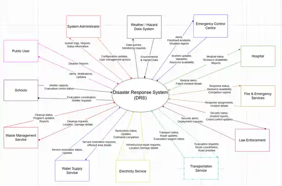

# CrisisOps

**Emergency Operations and Disaster Response Management System**

CrisisOps is a JavaFX desktop application for reporting disasters, managing incidents, assessing severity and priority, coordinating emergency resources, publishing public alerts, and tracking evacuation shelters.

The project began as an individual assessment project for **COIT20258: Software Engineering**, developed by **Jerald Christopher Bucud**. It was later selected as the foundation for the class's final group assessment and expanded collaboratively into a database-backed client-server application.

## Project Highlights

- Disaster reporting and incident registration
- Severity assessment and incident priority recommendations
- Incident status tracking, search, and filtering
- Emergency resource availability management
- Emergency dispatch and response logging
- Public alert creation and publication
- Evacuation shelter availability management
- Public user registration and authentication interfaces
- Role-specific dashboards and workflows for public users, emergency control centre staff, and system administrators
- Administrative user-management interface
- MySQL persistence through a DAO layer
- Multi-threaded socket server communication
- JUnit tests for selected application components

## System Showcase

<p align="center">
  
  
</p>

<p align="center">
  
  
</p>

<p align="center">
  
  
</p>

The screenshots use local demonstration data and show the portfolio branding applied to the completed academic application.

## My Role

**Original System Developer and JavaFX Integration Contributor**

I designed and developed the original application for the first two individual assessments in **COIT20258: Software Engineering**, including its JavaFX structure and core disaster-response workflows. When the system was selected as the base for the class's final group assessment, I continued contributing to the JavaFX frontend and integration work.

My contributions include:

- Original application architecture and JavaFX interface
- Disaster reporting and incident-management workflows
- Severity assessment and priority recommendation features
- Emergency resource availability tracking
- Incident search and filtering
- Login and public-user registration interfaces
- Role-specific dashboard access
- Public alert and evacuation shelter interfaces
- Administrator user-management interface
- Frontend client communication components
- Frontend-to-backend integration and interface refinement

The final server, database, DAO, testing, and integration work includes collaborative contributions. The original commit history has been preserved so the project's development and contributors remain visible.

## Project Evolution

| Stage | Development type | Outcome |
| --- | --- | --- |
| Assessment 1 | Individual | Requirements, use cases, sequence diagrams, MVC architecture, and preliminary interface designs |
| Assessment 2 | Individual | Working JavaFX prototype, resource availability tracker, incident search and filtering, and JUnit testing |
| Final group assessment | Collaborative | MySQL-backed client-server application with authentication interfaces, role-specific workflows, alerts, shelters, and user management |

<p align="center">
  
  
</p>

These images retain the original **DRS** and **DRS-Initial** branding because they are historical evidence from the individual assessment stages.

[View the complete project evolution and evidence](docs/PROJECT_EVOLUTION.md)

## Technology Stack

| Area | Technologies |
| --- | --- |
| Language | Java 17 |
| Desktop UI | JavaFX, FXML, CSS |
| Architecture | MVC-style desktop client, multi-threaded client-server communication |
| Database | MySQL, JDBC, DAO pattern |
| Testing | JUnit |
| Build and IDE | Apache Ant, NetBeans, Scene Builder |
| Collaboration | Git, GitHub branches, pull requests, and code review |

## System Roles

The JavaFX application presents role-specific dashboards and workflows for the following users:

| Role | Main capabilities |
| --- | --- |
| Public User | Register, sign in, report disasters, and view published public alerts |
| Emergency Control Centre | Manage incidents, severity, priority, dispatch, resources, shelters, and alerts |
| System Administrator | Access emergency-management functions and manage system users |

## Architecture Overview

CrisisOps uses a JavaFX desktop client connected to a multi-threaded Java server over sockets. The server processes client requests and accesses MySQL through DAO classes.

```text
JavaFX Client
     |
     | Socket requests and responses
     v
Multi-threaded Java Server
     |
     | Application logic and DAO layer
     v
MySQL Database
```

## Project Structure

```text
database/              MySQL schema and seed data
lib/                   Project libraries used by the original NetBeans build
src/drsinitial/        Java source code and JavaFX resources
test/drsinitial/       JUnit tests
nbproject/             NetBeans project configuration
build.xml              Apache Ant build file
docs/                  Portfolio documentation
```

The legacy Java package name `drsinitial` and database schema name `drs_enhanced` are retained to avoid breaking FXML controller paths, imports, tests, and database integration while keeping the portfolio copy close to the submitted assessment.

## Getting Started

### Requirements

- JDK 17
- NetBeans with Java support
- JavaFX SDK 17 or later
- MySQL Server and MySQL Workbench
- MySQL Connector/J

### Run the application

1. Clone this repository.
2. Open the project in NetBeans.
3. Run `database/drs_enhanced_setup.sql` in MySQL Workbench.
4. Set `CRISISOPS_DB_USERNAME` and `CRISISOPS_DB_PASSWORD` for your local MySQL account.
5. Add JavaFX and MySQL Connector/J to the project libraries when required by your NetBeans setup.
6. Run `drsinitial.server.DRSServer`.
7. Confirm that the server is listening on port `5000`.
8. Run `drsinitial.Main` to open the JavaFX client.

Detailed instructions are available in [docs/SETUP.md](docs/SETUP.md).

## Demonstration Accounts

The included seed data provides local demonstration accounts:

| Role | Username | Password |
| --- | --- | --- |
| System Administrator | `admin` | `admin123` |
| Emergency Control Centre | `ecc` | `ecc123` |
| Public User | `public` | `public123` |

These accounts are retained for local demonstration of the academic project. They must not be reused in a production environment.

## Known Academic Limitations

CrisisOps is presented as a completed academic software-engineering project rather than a production emergency-management platform. The portfolio repository intentionally preserves the submitted architecture and most of its implementation.

- Role separation is primarily implemented through JavaFX dashboards and application workflows; the socket server does not provide a production-grade session-token and per-request authorisation layer.
- The demonstration password compatibility and seed accounts were retained from the academic build and are not suitable as production security controls.
- Client-server communication is designed for local demonstration and does not use TLS.
- The project retains its original Apache Ant and NetBeans structure, including bundled libraries and local configuration requirements.
- Some administrative account-update behaviour remains limited in the final academic version.
- Automated continuous-integration checks and a packaged desktop release have not yet been added.

These limitations are documented instead of being hidden so the repository accurately represents the project that was assessed.

## Screenshots and Demo

Current CrisisOps interface screenshots are included in the **System Showcase** above. A short demonstration video has not yet been published.

## Academic Origin and Attribution

CrisisOps originated from the individual assessment stages of **COIT20258: Software Engineering**. The original system was selected as the foundation for the final group assessment in the same class and was subsequently enhanced through collaborative development.

- [Project Evolution and Evidence](docs/PROJECT_EVOLUTION.md)
- [Academic Origin and Attribution](docs/ACADEMIC_ORIGIN.md)

The original academic repository is preserved at:

https://github.com/JeraldBucud/DisasterResponseSystem

## Project Status

The completed academic version is functional as a JavaFX client, Java server, and MySQL application. This portfolio copy focuses on professional presentation, accurate attribution, secure local database configuration, and interface branding while intentionally avoiding a major redesign of the submitted assessment.

## Author

**Jerald Christopher Bucud**  
Master of Information Technology student majoring in Software Design and Development, with a minor in Artificial Intelligence.
