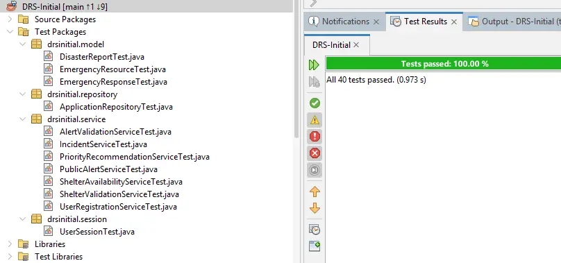

# CrisisOps Project Evolution

CrisisOps evolved through three assessment stages in **COIT20258: Software Engineering**. The first two assessments were completed individually by **Jerald Christopher Bucud**. The original system was then selected as the foundation for the class's final group assessment and enhanced collaboratively.

This page is based on the original Assessment 1 and Assessment 2 reports. The complete reports are not published in this repository because they contain personal and assessment-specific information.

## Stage 1: Individual Analysis and Design

**Assessment 1 — Requirements Engineering and System Design**

I analysed and designed the original Disaster Response System as a central platform for disaster reporting, incident assessment, emergency-response coordination, recovery activities, and system administration.

Individual work completed during this stage included:

- Context modelling and system-boundary definition
- Identification of external actors and response organisations
- Sixteen detailed use cases
- Functional, non-functional, and user requirements
- Four use-case diagrams
- Four sequence diagrams covering reporting, response, recovery, and administration
- Model-View-Controller architecture design
- Preliminary interface designs for public users, emergency control centre staff, response coordination, recovery, and administration

### Original context model

*Historical Assessment 1 evidence showing the original system boundary and its interactions with public users, emergency services, infrastructure providers, administrators, and hazard-data systems.*

## Stage 2: Individual JavaFX Prototype

**Assessment 2 — DRS-Initial Prototype**

The Assessment 1 design was reduced to a realistic prototype scope and implemented as a working JavaFX desktop application using JavaFX, FXML, Scene Builder, NetBeans, an MVC-style structure, in-memory application storage, and JUnit 4.

The implemented workflow included:

1. Report Disaster
2. Validate and Register Incident
3. Assess Severity
4. Prioritise Response
5. Dispatch Emergency Response
6. Update Incident Status

Two decision-support features were also implemented individually:

- **Emergency Resource Availability Tracker**
- **Incident Search and Filter**

### Emergency Resource Availability Tracker

*Historical Assessment 2 evidence showing available, assigned, unavailable, and maintenance units used to support dispatch decisions.*

### Historical prototype testing

The Assessment 2 report recorded a complete JUnit run in which all **28 core prototype tests passed**. This count applies only to the individual prototype and is retained as project-history evidence.

## Stage 3: Collaborative Enhancement

**Final Group Assessment — Completed System**

The DRS-Initial prototype was selected as the foundation for the class's final group assessment. The team expanded it into a more complete database-backed client-server system.

Collaborative enhancements included:

- Multi-threaded Java socket server
- MySQL database persistence
- DAO-based data access
- Authentication and public-user registration
- Role-aware JavaFX dashboards
- Public alert management
- Evacuation shelter management
- Administrative user management
- Frontend, backend, and database integration
- Expanded testing and documentation

### Current repository testing evidence

A full local JUnit 4 run of the current CrisisOps repository completed with **40 tests passing**.

*The screenshot records the current repository's local project test run. It is not an automated continuous-integration result.*

## My Role in the Completed System

**Original System Developer and JavaFX Integration Contributor**

My contributions include:

- Original requirements, architecture, and interface design
- Original JavaFX application and disaster-response workflows
- Incident severity and priority functionality
- Emergency resource availability tracking
- Incident search and filtering
- Login and public-user registration interfaces
- Role-aware dashboard navigation
- Public alert and evacuation shelter interfaces
- Administrator user-management interface
- Frontend client communication components
- Frontend-to-backend integration and interface refinement

The final completed system contains collaborative contributions. The repository preserves its Git history and contributor records so the individual and group stages remain transparent.

## Historical Evidence Note

The historical images on this page intentionally retain their original **DRS** and **DRS-Initial** branding. They document the system before it was renamed **CrisisOps** for its current public presentation.
